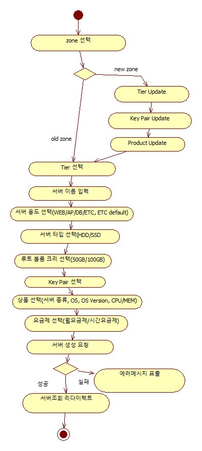

# 서버서비스

## 서버 생성

### 서버 생성 flow

1. 위치 선택

   - openAPI 호출: Tier 데이터 조회
     - 사용자 계정으로 signature 생성
   - openAPI 호출: Key Pair 조회
     - 사용자 계정으로 signature 생성
   - openAPI 호출: 상품 데이터 조회
     - 사용자 계정으로 signature 생성
2. Tier 선택
3. 서버 이름 입력
4. 서버 용도 선택(WEB/AP/DB/ETC, ETC default)
5. 서버 타입 선택(HDD/SSD)
6. 루트 볼륨 크리 선택(50GB/100GB)
7. Key Pair 선택
8. 상품 선택(서버 종류, OS, OS Version, CPU/MEM)#
9. 요금제 선택(월요금제/시간요금제)
10. 서버 생성 요청
    - openAPI 호출: 서버 생성
    - 사용자 계정으로 signature 생성

11. 서버 조회 요청
    - openAPI 호출: 서버 조회
    - 사용자 계정으로 signature 생성

### 서버 생성 Activity Diagram

### 연동 포인트

1. 오픈API
   1. Tier 조회
   2. Key Pair 조회
   3. 상품 조회
2. DB

- 없음
  
### API로 추출할 기능

- 사용자 계정으로 signature 생성 - openstack API
- 서버 용도 선택(WEB/AP/DB/ETC, ETC default) - 단순 Code API
- 상품 선택(서버 종류, OS, OS Version, CPU/MEM) - DB 조작 API
